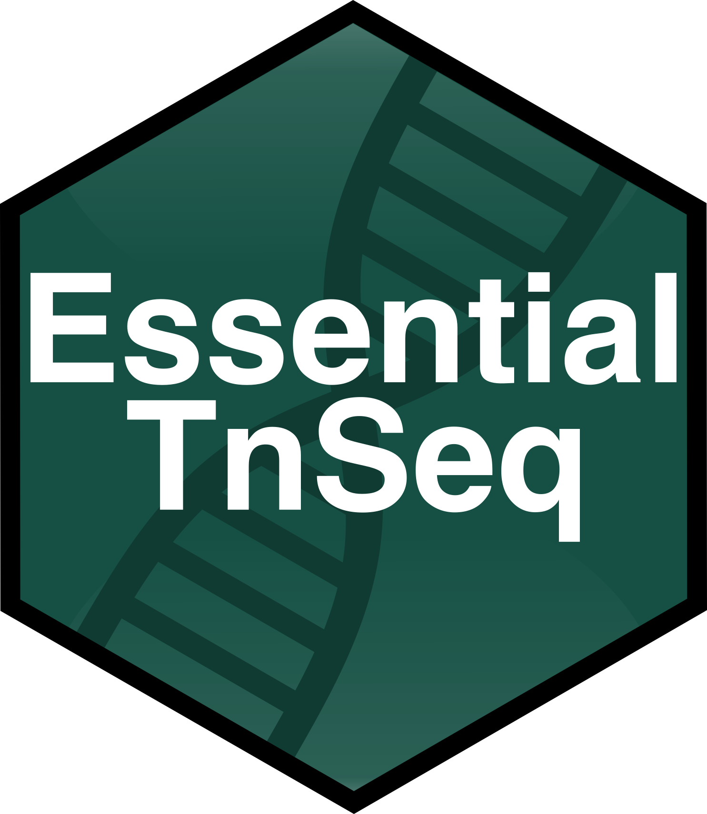

# **EssentialTnSeq**

The goal of EssentialTnSeq is to provide a series of functions to assist in
essentiality analysis from TnSeq data, performed with either Gumbel or Tradis.

***

### **Installation**

You can install the stable version of EssentialTnSeq from the 
[Github](https://github.com/hancockinformatics/EssentialTnSeq) with:
``` r
# First, install dependencies devtools and tidyverse
install.packages(c("devtools", "tidyverse"))

# Then install EssentialTnSeq
devtools::install_github("hancockinformatics/EssentialTnSeq")
```

### **Versioning**
This package makes use of [SemVer](https://semver.org/) for versioning.


### **Authors**

* Travis Blimkie - Originator and principal contributor

See also the [list of all
contributors](https://github.com/hancockinformatics/EssentialTnSeq/graphs/contributors).


### **License**
This project is written under the MIT license, available
[here.](https://github.com/hancockinformatics/EssentialTnSeq/blob/master/LICENSE.md)


### **Acknowledgements**
Thanks to everyone in the lab who has used these functions and provided
ideas/feedback!

<br>
